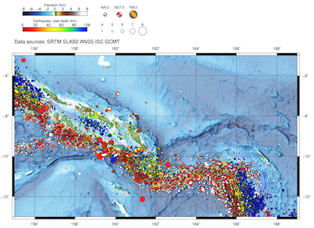
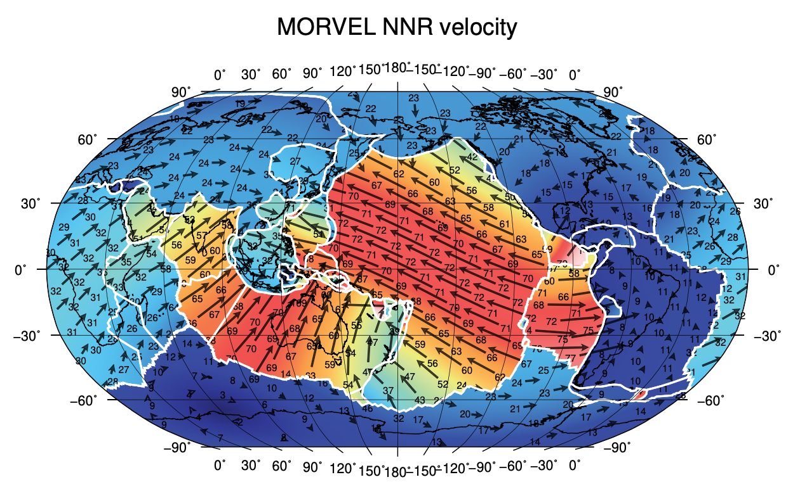
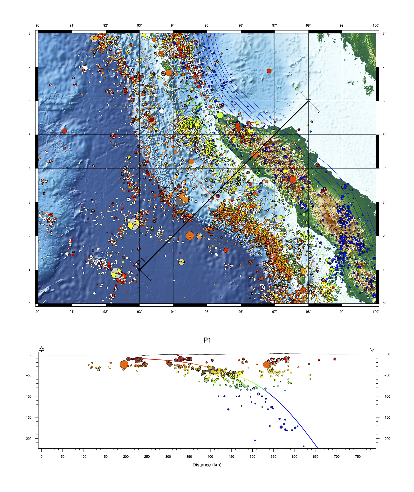
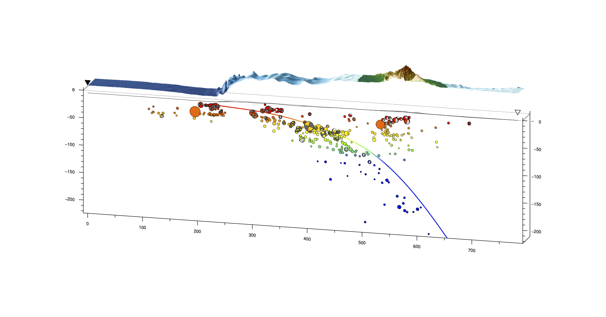
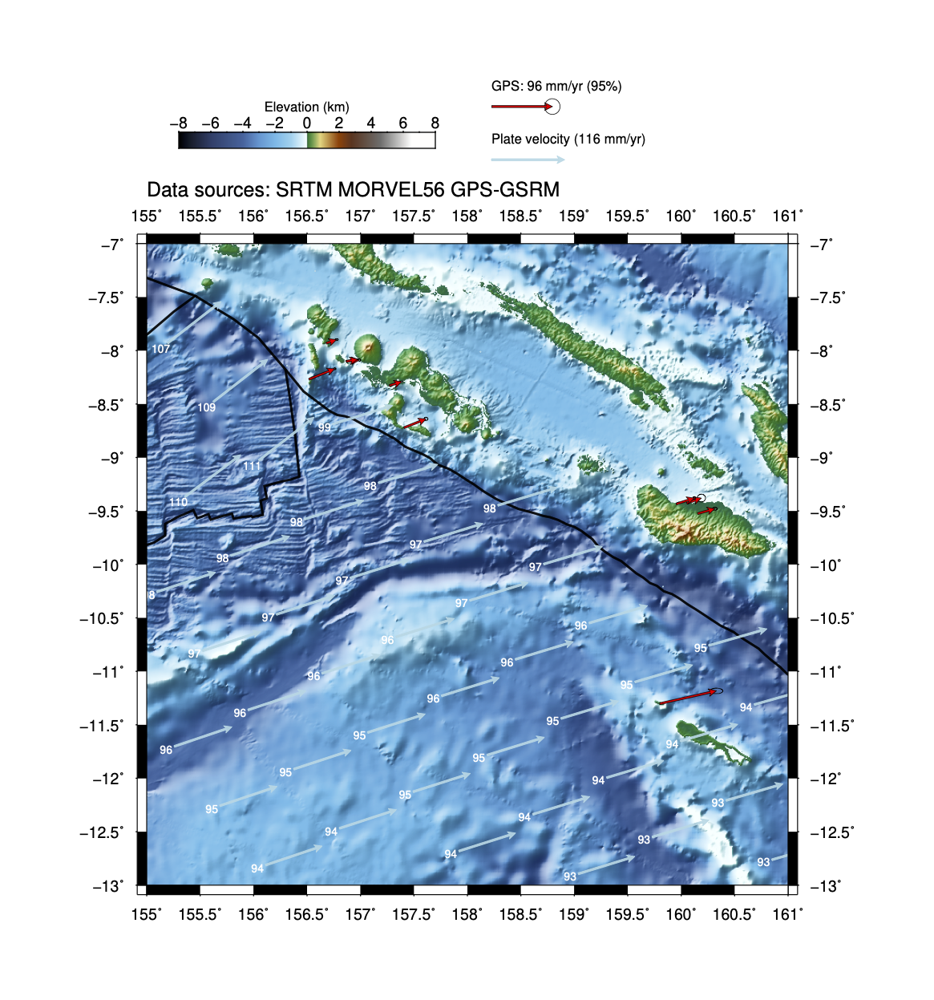
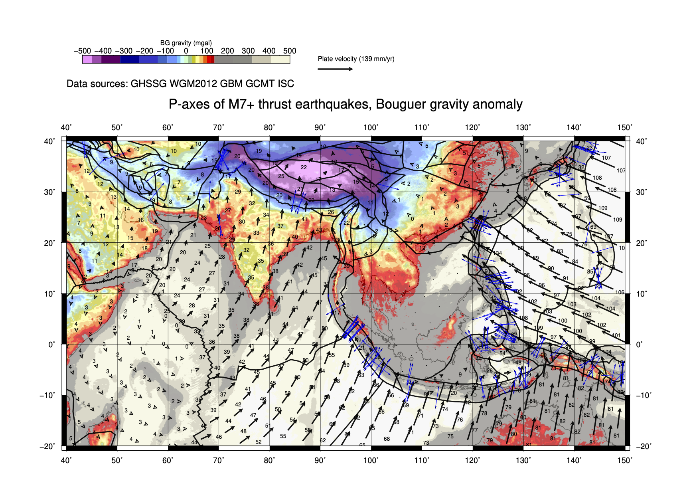

# tectoplot

Kyle Edward Bradley, Asian School of the Environment, Nanyang Technological University, Singapore - November 2020
kbradley@ntu.edu.sg

  

> tectoplot -r SB -t -gdalt 0.2 0.5 -b c -z -c --open --legend

  

> tectoplot -n -r g -p MORVEL NNR -pvg -a l -pf 1200 -i 1 -setvars { PLATELINE_COLOR white PLATEVEC_COLOR black PLATEVEC_TRANS 30 PLATEVELRES 0.5d COAST_KM2 1000 } -pe -o MORVEL_Global_Velocities.pdf -RJ { -Rd -JN180/5i } -title "MORVEL NNR velocity"

      
      

>  tectoplot -r 90 100 0 8 -t -b c -c -z -sprof 93 1 98 6 100k -oto -mob -msl

  

>  tectoplot -r 155 161 -13 -7 -t -p MORVEL pa -pe -pf 80 -g PA -pss 5 -pgo --legend

  

tectoplot -r 40 150 -20 40 -a l -v BG 30 -cm 7 10 --legend 3i -title "P-axes of M7+ thrust earthquakes, Bouguer gravity anomaly" -p GBM -pe -pf 400 -setvars { PLATEVEC_COLOR black PLATEVEC_TRANS 10 PLATEVEC_TEXT_COLOR black } -i 0.8 -ca t p

  

> tectoplot -t -mprof profile.control -title "Bouguer gravity anomaly (mgal)" --legend 
where profile.control contains:
`@ auto auto 200 500 /Users/kylebradley/Dropbox/scripts/tectoplot/Guadalcanal.xy null

^ /Users/kylebradley/Dropbox/TectoplotData/WGM2012/WGM2012_Bouguer_ponc_2min.grd 1 1k 150k 1k

P P2 black 0 N 156 -10 160 -5

P P1 red 0 N 158 -11 161.5 -7

P P3 green 0 N 155 -8 157.5 -5`

### Note: 
While I am currently working on this script in my spare time, I have not validated all of its functions and there are certainly some bugs/unforseen effects, especially in lesser-used functions. Not all of the functions are even good ideas in the first place. If you use this script for your research, please sanity check your own results!

## Overview
tectoplot is a bash script and associated helper scripts that makes seismotectonic maps, cross sections, and oblique block diagrams. It tries to simplify the process of visualizing data while also maintaining flexibility by running from the command line in a Unix environment and operating mainly on flat text-format data files. tectoplot started as a basic script to automate making shaded relief maps with GMT, and has snowballed over time to incorporate additional functions like plate motion models, swath profiles of topography or other data, cross sections, perspective block diagrams, etc. It will also plot TDEFNODE model results. 

tectoplot is intended for small-scale geological studies where maps are 10+km across and data are in geographic coordinates. More detailed areas with projected data are currently beyond the scope of the program.

Calculations generally leave behind the intermediate steps and final data in a temporary folder. This gives access to (for instance) raw swath profile data, filtered seismicity data, clipped DEMs or grids, etc. Some functions generate scripts that can be used to adjust displays or can be the basis of more complex plots (e.g. perspective diagrams). 

tectoplot will download and manage various publicly available datasets, like SRTM/GEBCO bathymetry, ISC/GCMT seismicity and focal mechanisms, global populated places, volcanoes, active faults, etc. It tries to simplify the seismicity catalogs to ensure that maps do not have (for instance) multiple versions of the same event. This process is currently a bit ad-hoc and could be improved. tectoplot can plot either centroid or origin locations for CMT data and will also draw lines to show the alternative location.

tectoplot's cross section functionality supports multiple profiles incorporating various kinds of data (swath grids like topography or gravity, along-profile sampled grids like Slab2 depth grids, XYZ data, XYZ seismicity data scaled by magnitude, and focal mechanisms). Profiles can be aligned in the X direction using an XY polyline that crosses the profiles, such as a trench axis, and can be aligned in the Z direction by matching profile values to 0 at this intersection point. This allows stacking of profiles. Profiles can have more than two vertices, and attempts are made to project data intelligently onto such profiles. Notably, a signed distance function is available that will extract topography in a distance-from-track and distance-along-track-of-closest-point-on-track space, which avoids some of the nasty artifacts arising from kinked profiles. 

## Credits for external code used: 
A heavily modified version of ndk2meca.awk by Thorsten Becker (NDK to PSMECA conversion script)

## Setup

tectoplot requires GMT6.1, gdal, geod, and a standard UNIX command line environment (awk, bc, cat, curl, date, grep, sed).
It is verified to run on MacOSX 10.15.4 and Fedora Linux, but no attempts have been made to ensure portability (yet).

Download and extract the ZIP file from Github, or install it using git:

`git clone https://github.com/kyleedwardbradley/tectoplot.git tectoplot`

Installation and setup information can be found by running the script from its source directory:

`./tectoplot -setup`
